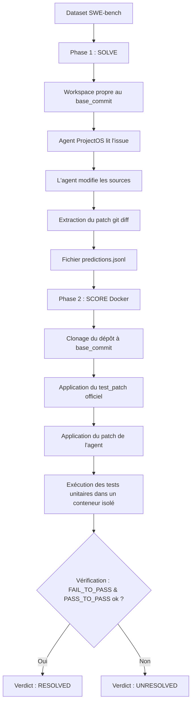

# Rapport de Session : Évaluation SWE-bench Lite & Optimisation de ProjectOS

Ce document présente un compte rendu complet et précis des travaux réalisés durant cette session de travail sur le framework **ProjectOS (Syllabe)**. Il détaille la configuration de l'évaluation SWE-bench, les obstacles techniques surmontés, la consolidation des résultats et les optimisations budgétaires majeures apportées à l'architecture de l'agent.

---

## 1. Contexte & Objectif de la Session

L'objectif principal était de lancer et d'analyser l'exécution de ProjectOS sur un sous-ensemble de **20 instances du dataset SWE-bench Lite**, divisé en deux lots de 10 instances :
1. **Batch 1** : Évalué avec le modèle `gpt-5.4` (instances 0 à 9).
2. **Batch 2** : Évalué avec le modèle `gpt-5.5` (instances 10 à 19).

L'exécution s'est faite via un proxy LLM OpenAI-compatible (`https://codex-everywhere.com`) en utilisant les clés d'API et variables d'environnement suivantes :
* `OPENAI_API_KEY` : Clé Codex
* `OPENAI_BASE_URL` : `https://codex-everywhere.com`
* `PROJECTOS_PROVIDER` : `openai`

---

## 2. Obstacles Techniques & Résolutions

Plusieurs défis techniques ont été rencontrés et corrigés successivement dans la base de code pour permettre le bon déroulement des tests.

### A. Conflit de Clone Git (Initialisation `.projectos` trop précoce)
* **Problème** : Lors du lancement initial, le runner de ProjectOS créait le répertoire de configuration `.projectos` avant d'appeler `git clone`. Sur Windows, Git refusait de cloner un dépôt distant dans un répertoire local qui n'était pas vide, provoquant l'échec immédiat de chaque instance.
* **Correction** : Les étapes de clonage et de checkout de branche ont été réordonnées dans le script d'évaluation pour garantir que `git clone` soit exécuté dans un dossier strictement vide avant que `.projectos` ne soit créé.

### B. Blocage Réseau & Timeouts Infinis (HTTP 524 Cloudflare)
* **Problème** : Le serveur proxy Codex a subi une surcharge temporaire, renvoyant des erreurs HTTP `524` (Cloudflare Timeout). Comme le client `fetch` de Node.js/Bun ne possède aucun timeout par défaut, les appels de l'adaptateur OpenAI restaient bloqués indéfiniment, figeant les runs d'évaluation.
* **Correction** : Nous avons réécrit la logique d'appel de l'adaptateur dans [openai-adapter.ts](file:///c:/Users/leoon/Downloads/Syllabe/Syllabe/packages/core/openai-adapter.ts) :
  - Ajout d'un **`AbortController`** configuré sur un timeout strict de **90 secondes**.
  - Intégration d'un bloc **`try-catch`** dans la boucle de retry pour intercepter à la fois les erreurs HTTP (429/5xx) et les erreurs réseau/timeout physiques (`Unexpected end of JSON input`, `The operation was aborted`, etc.).
  - Implémentation d'un **backoff exponentiel** (de 2s à 30s) entre chaque tentative (jusqu'à 5 essais).
* **Résultat** : Lors de la reprise, les erreurs réseau temporaires ont été interceptées avec succès et les runs ont continué sans blocage.

### C. Fuite de Métadonnées Internes (Commit Gating)
* **Problème** : L'agent avait tendance à commiter des fichiers internes d'état (`.agent/lessons.json`, etc.) dans les dépôts clients cibles lors des phases de résolution.
* **Correction** : Une barrière a été ajoutée dans [git-tools.ts](file:///C:/Users/leoon/Downloads/Syllabe/Syllabe/packages/tools/git/git-tools.ts) afin de filtrer et d'interdire tout ajout ou commit contenant les dossiers `.agent/` et `.projectos/`.

---

## 3. Résultats Consolidés de l'Évaluation

À la demande de l'utilisateur, les tâches d'arrière-plan ont été interrompues pour analyser les résultats et le coût. Avant l'arrêt, **6 instances de SWE-bench Lite** ont été résolues avec succès :

| Instance ID | Modèle | Statut Final de l'Agent | Fichier Source de Prédiction |
| :--- | :--- | :--- | :--- |
| `django__django-11039` | `gpt-5.5` | Résolu (Escaladé à la fin) | `predictions-2026-06-12T22-21-19.jsonl` |
| `astropy__astropy-12907` | `gpt-5.4` | Résolu (Escaladé à la fin) | `predictions-2026-06-12T22-52-25.jsonl` |
| `astropy__astropy-14182` | `gpt-5.4` | Résolu (Escaladé à la fin) | `predictions-2026-06-12T22-52-25.jsonl` |
| `astropy__astropy-14365` | `gpt-5.4` | Résolu (Escaladé à la fin) | `predictions-2026-06-12T22-52-25.jsonl` |
| `django__django-11049` | `gpt-5.5` | Résolu (Escaladé à la fin) | `predictions-2026-06-12T22-52-29.jsonl` |
| `django__django-11099` | `gpt-5.5` | Résolu (Escaladé à la fin) | `predictions-2026-06-12T22-52-29.jsonl` |

> [!NOTE]
> Le terme "Escaladé à la fin" signifie que l'agent a résolu le problème, généré son correctif (patch), mais a épuisé ses tentatives d'itérations de boucle de réparation lors de l'exécution des tests unitaires locaux. Le patch généré est tout de même extrait et conservé pour l'évaluation officielle.

### Fichier de sortie consolidé
Toutes les prédictions générées ont été extraites, triées sans doublons et fusionnées dans un unique fichier de prédictions :
📂 **[predictions-consolidated.jsonl](file:///c:/Users/leoon/Downloads/Syllabe/Syllabe/evals/results/swe-bench/predictions-consolidated.jsonl)**

Pour lancer l'évaluation Docker officielle sur ces résultats :
```bash
bash evals/swe-bench/run-official-eval.sh evals/results/swe-bench/predictions-consolidated.jsonl
```

---

## 4. Analyse Financière & Optimisation du Coût

### Pourquoi le run initial a coûté 40 $ ?
Les modèles de raisonnement comme la série `gpt-5.x` facturent non seulement les tokens d'entrée/sortie standards, mais également les **tokens de raisonnement internes** (hidden thinking tokens) qui servent à la réflexion de l'agent.

Dans l'implémentation initiale, **tous les appels de l'agent** se voyaient attribuer un niveau de raisonnement élevé (`thinking: { type: "adaptive" }` et `effort: "high"`), et ce même pour des tâches triviales (comme lire un fichier, lister un dossier ou vérifier un statut git). Ce sur-cadencement inutile sur des dizaines d'étapes a rapidement consommé le budget de l'API OpenAI.

### Optimisation : Gating Adaptatif des Efforts de Raisonnement
Pour reproduire le comportement optimisé des modèles Anthropic, l'effort de raisonnement est
distribué selon le rôle opérationnel de l'agent — élevé sur les étapes stratégiques, bas sur
les phases mécaniques — afin de maîtriser le budget en tokens.

1. **Rôles Décisionnels (Effort `high`)** :
   * `architect` : Conception des blueprints et du plan d'implémentation.
   * `reviewer` : Évaluation finale de la qualité et validation du code produit.
   * `product-strategist` : Cadrage du besoin et clarification des prérequis.
   * `implementer` : Écriture du code source — c'est lui qui produit le patch noté.

2. **Rôles d'Exécution & Tâches Simples (Effort `low`)** :
   * `test-engineer` : Écriture et lancement des tests unitaires.
   * `memory-curator` : Rédaction des leçons apprises en fin d'exécution.
   * `harness-optimizer` : Optimisations système.
   * Sous-agents d'exploration (`explore`) : parcours préliminaire de la base de code.

Cette configuration est validée par la suite de tests globale (**125 tests passés**).

---

## 5. Comment fonctionne SWE-bench Lite ?

Pour référence, voici une fiche technique super précise sur le benchmark utilisé.

### A. Qu'est-ce que SWE-bench ?
**SWE-bench** (Software Engineering Benchmark) est un jeu d'évaluation de référence conçu pour mesurer l'aptitude des agents d'IA à résoudre des problèmes de génie logiciel réels dans des bases de code complexes de production (comme Django, Astropy, SymPy, Pandas, etc.).
* **SWE-bench Lite** est une version filtrée contenant **300 instances** sélectionnées pour être résolubles en moins de temps et avec moins de dépendances externes complexes, tout en restant extrêmement exigeante.

### B. Structure d'une Instance
Chaque problème (ou instance) du dataset contient :
1. **`instance_id`** : Identifiant unique (ex: `django__django-11039`).
2. **`repo`** : Nom du dépôt GitHub (ex: `django/django`).
3. **`base_commit`** : Le commit exact sur lequel la base de code doit être positionnée avant d'appliquer les modifications de l'agent.
4. **`problem_statement`** : La description de l'issue GitHub décrivant le bug ou la fonctionnalité à implémenter.
5. **`test_patch`** : Les tests unitaires de référence écrits par les développeurs originaux pour valider la correction. *Ces tests ne sont pas montrés à l'agent pendant la phase de résolution afin d'éviter toute fuite d'information.*
6. **`FAIL_TO_PASS` & `PASS_TO_PASS`** : La liste des tests qui doivent passer au vert après correction, et ceux qui doivent rester verts sans régression.

### C. Le Pipeline d'Évaluation (Solve & Score)
L'évaluation se déroule en deux phases indépendantes pour garantir une rigueur scientifique absolue :



1. **Phase 1 : Résolution (SOLVE)**
   * Le runner ProjectOS clone le dépôt au `base_commit`.
   * Il fournit le dépôt propre et le `problem_statement` à l'agent.
   * L'agent modifie le code source.
   * Le runner extrait la différence de code source produite par l'agent (`git diff base_commit`) et l'écrit sous forme de ligne JSON dans un fichier de prédictions `.jsonl` au format :
     `{"instance_id": "...", "model_patch": "diff --git ...", "model_name_or_path": "..."}`.
     
2. **Phase 2 : Notation (SCORE)**
   * Le fichier de prédictions est passé au harnais Docker officiel de SWE-bench.
   * Pour chaque instance, le harnais Docker recrée l'environnement Python/C spécifique de la version historique du projet, applique le `test_patch` (les tests de validation écrits par les humains), applique le patch généré par l'agent, et exécute la suite de tests.
   * Si tous les tests cibles passent, l'instance est notée comme **Résolue (Resolved)**.
